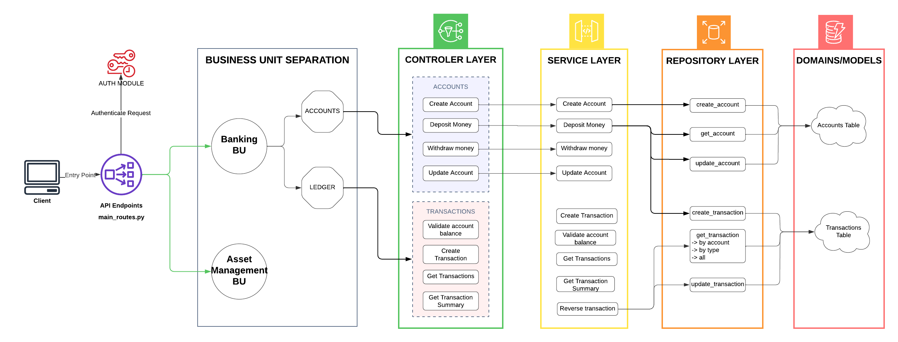

## Overview
- This project is a simulation of real-world bank application. It follows the best practices needed to design scalable, secure and efficient backend API endpoints in FastAPI (python).

## Architecture

- **ONION Architecture:** Highly Modular structure. Breakdown of API endpoints into Logical Units related to business model.
  - Controllers: Gateway to the endpoint. They are the delegators of work.
  - Services: To handle business logic. 
  - Repository/Dao: Although not the same, they essentially perform operations on database and provide tools for service layer to implement its logic.
  - Domain/Models: Represents the database tables and views.

## Features

- **Secure API's:** API should only be accessed by users with appropriate access.
- **Strict Typing:** Request and Response Bodies have a pydantic model typing to them. This ensures 
- **Error Handling:** try-catch. Errors are raised in each layer which bubbles up in the catch block within the main controller.
- **Asynchronous behavior:** FASTAPI works on ASGI server, which is well suited for asynchronous behavior, something essential when working with ML or Language models.
- **Designed for scalability:** modularization and segregating functionality allows to build a highly scalable yet maintainble codebase.
- **API documentation:** FastAPI allows for a ready-made swagger implmentation.
- **Soft deletes:** Never delete any sensitive data. Rather mark it as delete using flag but make sure it appears to be deleted.
